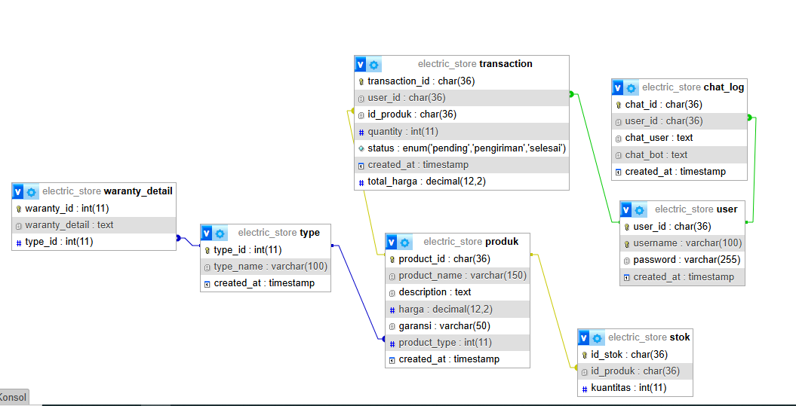

# 🛠 AI Customer Support Service

Sistem AI Agent untuk menjawab pertanyaan pelanggan terkait produk, garansi, transaksi, dan percakapan sebelumnya.  
Agent menggunakan memori berbasis database SQL untuk mengingat chat sebelumnya dan memberikan respons yang konsisten.

---

## 📦 Instalasi & Requirement

### 1. Persiapan Environment Lokal
Pastikan sudah terinstall:
- **Python 3.10+**
- **pip** (package manager)
- **SQL** Seperti mariadb, saya mau aslinya mau pake postgre, tapi mengikuti ketentuan.
- **Ollama** untuk init ke llama 3.2:3b
- **LLAMA3.2:3b** pastikan sudah di pull
- **Langchain_Comunity** pastikan sudah di install

### 2. Cara Instalasi
Clone repository dan install dependency:

```bash
git clone https://github.com/username/project-name.git
cd project-name

# (Opsional) Buat virtual environment
python -m venv venv
source venv/bin/activate   # Linux / Mac
venv\Scripts\activate      # Windows

# Install dependencies
pip install -r requirements.txt

```

Jalankan aplikasi:
```bash
python run.py
```

---

## 🗄 Desain Database

**data base saya terdiri dari 7 table.**<br>
seperti gambar dibawah ini:<br>
<br>
**-Table Produk**
table produk adalah table yang berisi informasi mengenai produk yang akan di tawarkan

**-Table Produk**
table type merupakan table yang berisi infromasi tipe barang, kayak mesin cuci, televisi, kulkas.

**-Table Produk**
table transaction merupakan table yang berisi informasi tentang transaksi yang telah dilakukan.

**-Table Produk**
table chatlog merupakan table yang berisi informasi tentang riwayat chat user dengan chatbot, bergunakan untuk memory untuk llm.

**-Table Produk**
table user merupakan table yang berisi informasi tentang user seperti user_id.

**-Table Produk**
table waranty_detail merupakan table yang berisi tentang informasi batasan batasan kerusakan yang dapat di garansi tergantung tipe nya.<br>

Table stok tidak digunakan

## 📚 Library & Framework yang Digunakan


---

## 🧠 Model LLM yang Digunakan

| Komponen          | Model / Service     |
|------------------|-------------------|
| **LLM Core**     | LLAMA 3.2:3b(Lokal) |
| **Prompting**    | Custom prompt untuk klasifikasi `alur` dan pembuatan jawaban |
| **Memori**       | SQL database + retrieval dari 3 chat terakhir |

---

## ❓ Daftar Pertanyaan yang Dapat Dijawab

- **Produk (alur = a):**  
  - "menanyakan keseluruhan produk"
  - "membandingkan antar produk"
  - "menanyakan keunggulan produk"
- **Garansi (alur = b):**  
  - "menayakan secara general garansi produk tersebut"
  - "menanyakan secara spesifik kerusakan terhadap produk dan dapat diclaim garansi atau tidak"
- **Transaksi (alur = c):**  
  - "manyakan status pesanan pada transaksi "
  - "menanyakan informasi lebih detail tentang informasi pesanan
- **pertanyaan diluar konteks (alur = d):**  
  - "menanyakan hal hal random dan cara menangani nya"

---

## 🛠 Daftar Tool Call

Agent mendukung tool call berikut:
- **product_detail(question, language)** → Mendapatkan detail produk
- **waranty_explainer(question, language)** → Menjelaskan detail garansi
- **tracking_transaction(question, language, user_id)** → Mengecek status transaksi
- **orther_respond(question, language, user_id, chat_data)** → Memberikan jawaban berbasis chat sebelumnya

---

## 🧪 Cara Uji


## 📄 Lisensi
MIT License – bebas digunakan dan dimodifikasi.
